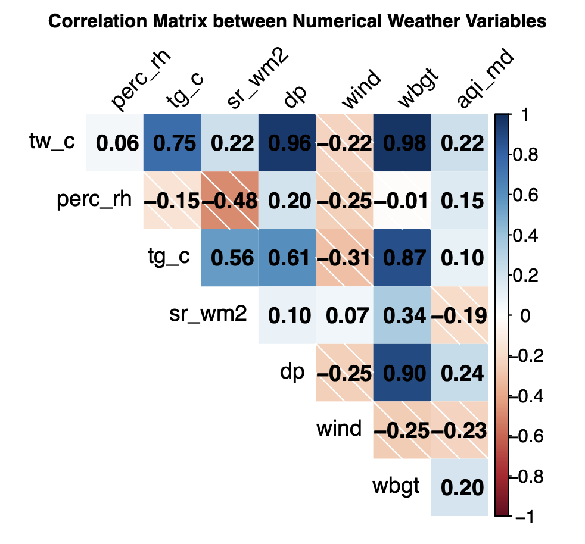

# README

This is a README file for Project 1 ("Exploratory Data Analysis") completed in the course "Practical Data Analysis" (PHP2550) at Brown University. The course is taught by Dr. Alice Paul. 

## Folder structure

- README.md: Readme file 
- `admin`: Administrative files (e.g. project description, project guidelines)
- `code`: Code used in the final report
- `data`: Raw data used in the final report (Not visible due to confidentiality)
- `fig`: Figures generated in the final report
- `output`: Intermediate data files (e.g. cleaned data, merged data)
- `results`: Report 

## Abstract

Endurance exercise performance is degraded with increasing environmental temperature, and the decline in performance associated with warmer temperatures is magnified with longer-distance events such a the marathon footrace (42.2k). In addition, older adults experience thermoregulatory challenges that impair their ability to dissipate heat, which can further exacerbate the impact of warmer temperatures. Finally, there are well-documented sex differences in endurance performance and in physiological processes related to thermoregulation. We find that completion time varies significantly by age, following a non-linear trend. Although the performance quartiles are relatively stable across flag conditions, there is a significant correlation between the weather variables. All in all, we find that solar radiation, relative humidity, and wet bulb globe temperature are the most significant predictors of completion time.

## Key Findings 

- Completion time follows a linear, then quadratic trend, also across gender 

-  Completion quartiles are relatively stable across flag conditions

- There is significant correlation between the weather variables

## Contact

The author can be contacted at [daniel_posmik@brown.edu](mailto:daniel_posmik@brown.edu)

