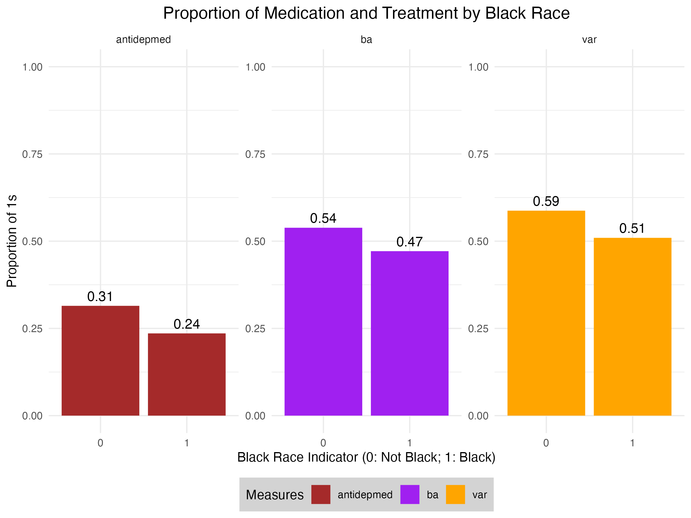
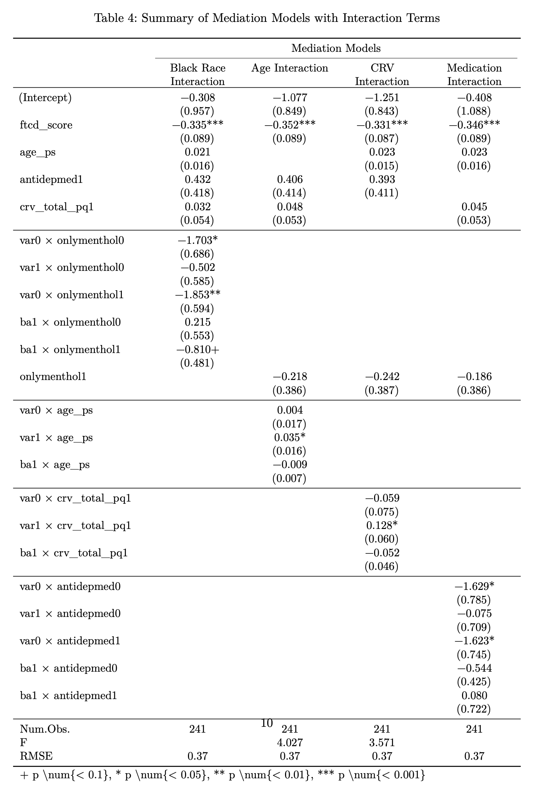

# README

This is a README file for Project 2 ("Regression Analysis of Smoking Cessation") completed in the course "Practical Data Analysis" (PHP2550) at Brown University. The course is taught by Dr. Alice Paul

## Folder structure

- README.md: Readme file 
- `admin`: Administrative files (e.g. project description, project guidelines)
- `data`: Raw data used in the final report
- `fig`: Figures used in the final report
- `results`: Report 

## Abstract

In this project, we investigate potential mediators of smoking cessation amongst adults experiencing major depressive disorder. We consider a 2x2 factorial design comparing behavioral activation for smoking cessation (BASC) to standard behavioral treatment (ST); as well as varenicline versus placebo. We find that while FTCD score is the only significant predictor (at $\alpha = 0.05$) of smoking cessation, smoking cessation is significantly mediated by the black race indicator. Moreover, there is slight evidence around the mediation of age, the use of antidepression medication, and a measure of the perceived reward of cigarettes. 

## Key Findings 

- We find evidence of mediation by black race and address the colliding path with an IV approach using menthol cigarette use 

- We find that smoking cessation is significantly mediated by black race, and moderately by age, the use of antidepression medication, and a measure of the perceived reward of cigarettes

## Contact

The author can be contacted at [daniel_posmik@brown.edu](mailto:daniel_posmik@brown.edu)

