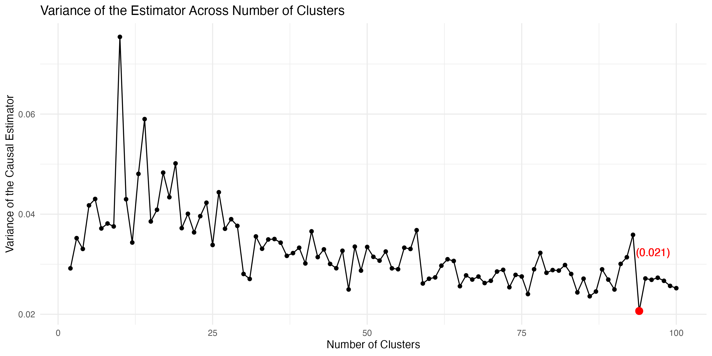
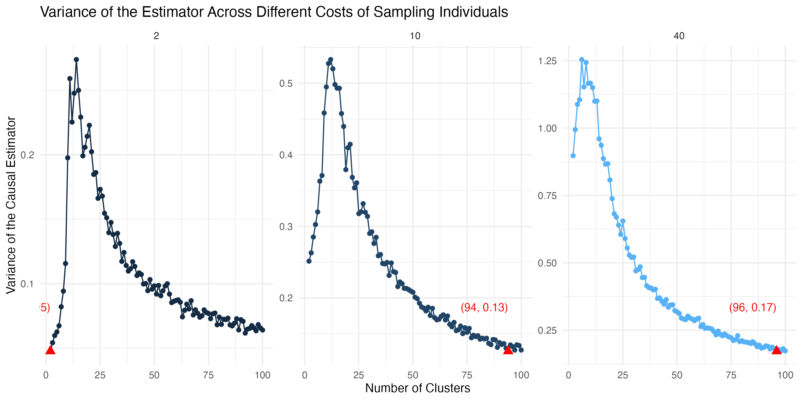
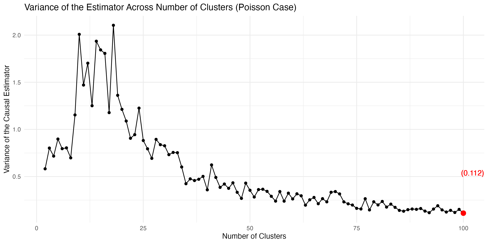

# README

This is a README file for Project 3 ("Simulation Project") completed in the course "Practical Data Analysis" (PHP2550) at Brown University. The course is taught by Dr. Alice Paul. 

## Folder structure

- README.md: Readme file 
- `admin`: Administrative files (e.g. project description, project guidelines)
- `code`: Simulation code (Numbered by Aim; `00_func.R` contains all functions used in the simulation)
- `img`: Images used in the final report
- `output`: Simulated data generated from files in the `code` folder 
- `results`: Report 

## Abstract

In this project, we explore optimal designs for cluster randomized trials. We begin by discussing the underlying data generating mechanisms and provide a detailed summary of our goals and procedures using the ADEMP framework. We simulate the results for different numbers of clusters and identify the point of minimum variance. We also provide a brief theoretical discussion on optimal design in cluster randomized trials, building off Raudenbush (1997). We then explore how the choices of different parameters impact the optimal study design. We vary the true fixed and treatment effects, the treatment assignment probability, the sampling costs, and the variances of the noise terms. Lastly, we extend our simulation study to the setting in which the outcome variable follows a Poisson distribution. All in all, we find that sampling more clusters tends to minimize the variance of the treatment effect estimator. This result holds across a reasonable range of varied parameters. That being said, this result is only sensitive to the cost of sampling individuals within a cluster. When individual sampling cost is low, we can expect to see the variance-minimizing number of clusters to be on the left side of the peak. These results remain consistent across the normal and Poisson cases.

## Key Findings 

- Sampling more clusters tends to minimize the variance of the treatment effect estimator.

- The variance-minimizing number of clusters is sensitive to the cost of sampling individuals within a cluster. When individual sampling cost is low, we can expect to see the variance-minimizing number of clusters to be on the left side of the peak.

- These results remain consistent across the normal and Poisson cases.

## Contact

The author can be contacted at [daniel_posmik@brown.edu](mailto:daniel_posmik@brown.edu). 
